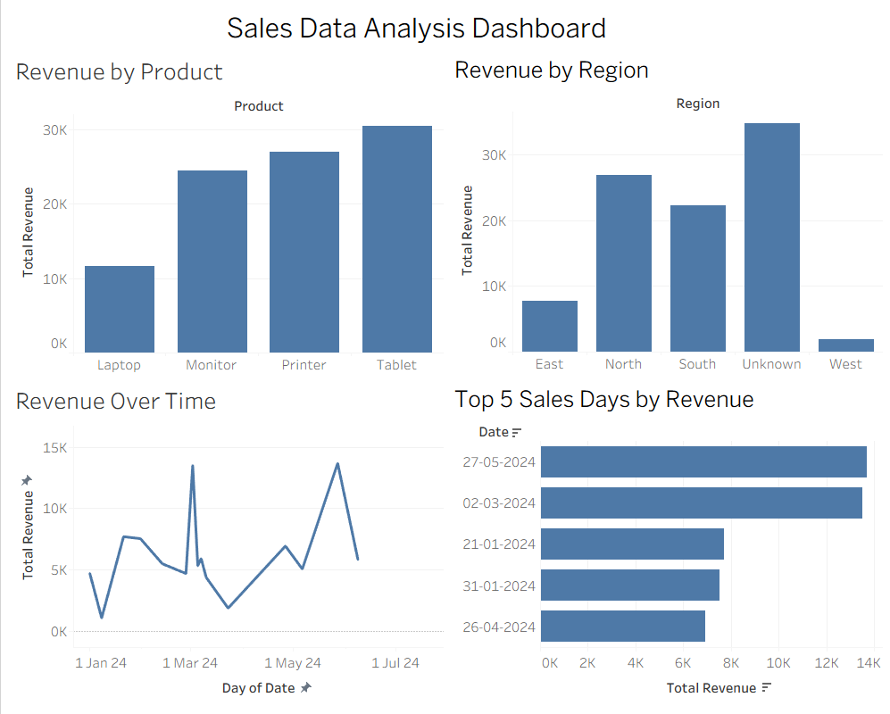

\# Data Science Internship Projects


A collection of practical Data Science projects developed during my Data Science internship. The projects cover Python programming, data analysis, data visualization, statistical analysis, Tableau dashboards, and machine learning.


\## 📌 Projects


\### 1. Basic Student Performance Analysis


A Python-based project that analyzes student performance using fundamental Python programming concepts.


\*\*Concepts covered:\*\*

\- Lists and dictionaries

\- String operations

\- Arithmetic operations

\- Conditional statements

\- Loops

\- User-defined functions

\- `break` and `continue`

\- Average, highest, and lowest grades

\- Pass/Fail classification


\---


\### 2. Advanced Sales Data Analysis


A sales analysis project that demonstrates the use of Python data structures and data science libraries.


\*\*Concepts and tools covered:\*\*

\- Lists

\- Tuples

\- Sets

\- Dictionaries

\- NumPy

\- Pandas

\- Seaborn

\- Matplotlib

\- Plotly

\- Product-wise and region-wise sales analysis

\- Sales visualization


\---


\### 3. Sales Data Dashboard


A sales data analysis and visualization project that prepares data using Python and creates an interactive dashboard using Tableau.


\*\*Work performed:\*\*

\- Data loading and cleaning

\- Missing and invalid data handling

\- Data type conversion

\- Revenue calculation

\- Product-wise revenue analysis

\- Region-wise revenue analysis

\- Revenue trend analysis

\- Top 5 sales days analysis

\- Statistical analysis

\- Correlation analysis

\- Seaborn visualization

\- Plotly visualization

\- Tableau dashboard


\*\*Dashboard includes:\*\*

\- Revenue by Product

\- Revenue Over Time

\- Revenue by Region

\- Top 5 Sales Days by Revenue


### 📊 Tableau Dashboard



The interactive Tableau dashboard provides visual analysis of sales revenue across products, regions, and time.


\---


\### 4. Simple Linear Regression – House Price Prediction


A machine learning project that uses Simple Linear Regression to predict house prices based on the number of rooms.


\*\*Work performed:\*\*

\- Dataset loading and exploration

\- Missing value analysis

\- Correlation analysis

\- Feature and target selection

\- Train-test split

\- Linear Regression model training

\- House price prediction

\- Model evaluation

\- Actual vs Predicted visualization

\- Regression line visualization

\- Regression equation

\- Prediction for a new house

\- Prediction results export


\*\*Model evaluation:\*\*

\- Mean Squared Error (MSE): `46.6308`

\- R² Score: `0.3677`


\*\*Regression Equation:\*\*


`Price = -36.22 + (9.34 × room\_num)`


\---


\## 🛠️ Technologies Used


\- Python

\- Jupyter Notebook

\- Pandas

\- NumPy

\- Matplotlib

\- Seaborn

\- Plotly

\- Scikit-learn

\- Tableau

\- Git \& GitHub


\---


\## 📂 Repository Structure


```text

Data-Science-Internship-Projects/

│

├── 01\_Basic\_Student\_Performance\_Analysis/

│   └── notebook/

│       └── Basic\_Student\_Performance\_Analysis.ipynb

│

├── 02\_Advanced\_Sales\_Data\_Analysis/

│   └── notebook/

│       ├── Advanced\_Sales\_Data\_Analysis.ipynb

│       └── iframe\_figures/

│

├── 03\_Sales\_Data\_Dashboard/

│   ├── notebook/

│   │   └── Sales\_Data\_Dashboard.ipynb

│   ├── data/

│   │   └── sales\_data.csv

│   ├── output/

│   │   └── cleaned\_sales\_data.csv

│   └── Sales\_Data\_Dashboard.twbx

│

└── 04\_Simple\_Linear\_Regression\_House\_Price/

&#x20;   ├── notebook/

&#x20;   │   └── Simple\_Linear\_Regression\_House\_Price.ipynb

&#x20;   ├── data/

&#x20;   │   └── House\_Price.csv

&#x20;   └── output/

&#x20;       └── prediction\_results.csv

